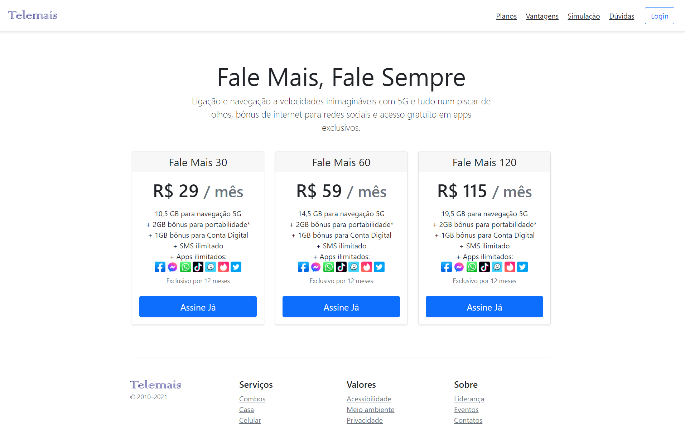
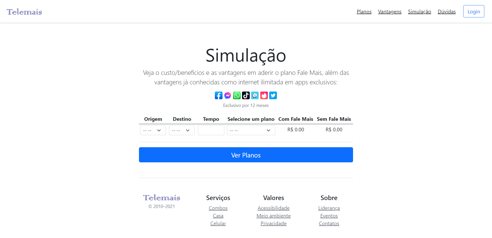
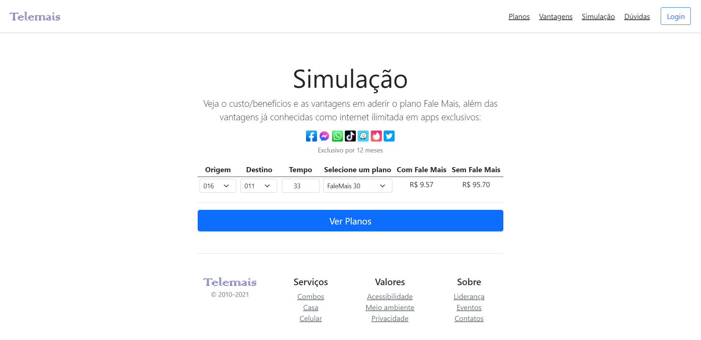
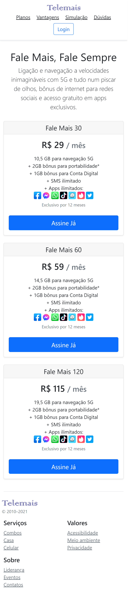
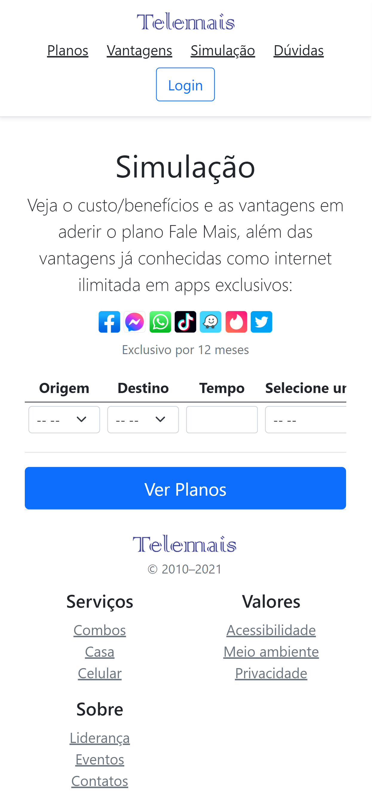
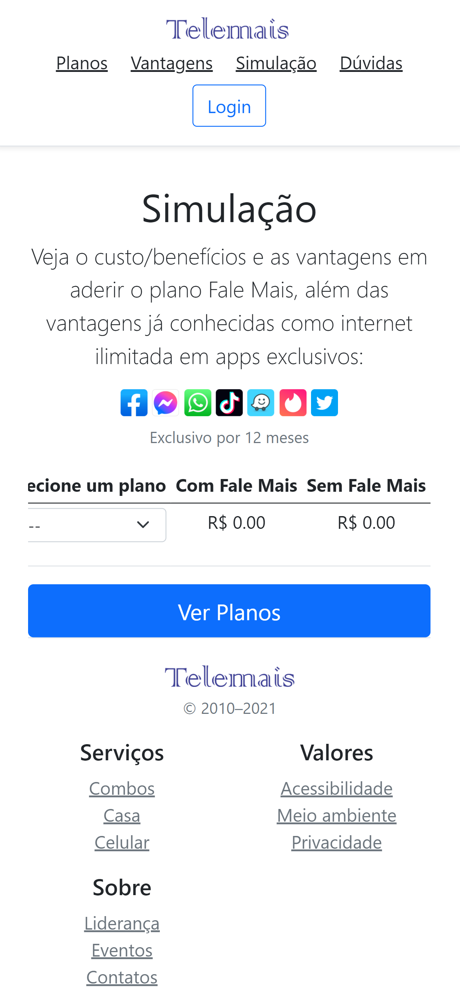

<h1 align="center">
    
</h1>

<h4 align="center"> 
	🚀  Telemais: Fale Mais ✨ Concluído!  🚀
</h4>

 <a href="#-sobre-o-projeto">Sobre</a> •
 <a href="#-funcionalidades">Funcionalidades</a> •
 <a href="#-layout">Layout</a> • 
 <a href="#-como-executar-o-projeto">Como executar</a> • 
 <a href="#-tecnologias">Tecnologias</a> •  
 <a href="#-autor">Autor</a> • 

## 💻 Sobre o projeto

O projeto é um desafio para avaliação em um processo de seleção.

O desafio trata-se sobre campanha publicitária promovido pela empresa Telemais com demonstração da simulação de custos de ligação por minuto dos DDD's de 011, 016, 017 e 018 em determinados planos oferecidos ao cliente.

<i>Obs: O nome da "empresa" que promove a campanha foi modificado por se tratar de processo seletivo ainda em andamento, assim como o nome da empresa que solicitou o projeto foi ocultado.</i>

---

## ⚙️ Funcionalidades

- [x] Seleção do produto desejado.

- [x] Simulação mostra o custo total das ligações específicas x tempo gasto x plano selecionado.

---

## 🎨 Layout

### Web

  

  

  

### Mobile

  

  

  

---

## 🚀 Como executar o projeto

Este projeto é divido em duas partes:
1. Home e seleção do plano.
2. Simulação do custo por minuto
   1. A simulação é feita primeiramente com a selação de DDD de origem.
   2. O DDD de destino se ajusta de acordo com a origem para que forneça apenas a equação conforme os dados foram passados.
   3. O tempo e a seleção de plano são selects simples.
   4. Os resultados são transmitidos automaticamente ao selecionar as opções dos dados de entrada.

---

## 🛠 Tecnologias

As seguintes ferramentas foram usadas na construção do projeto:

-   **HTML5**
-   **CSS3**
-   **[Javascript](https://www.javascript.com/)**
-   **[Bootstrap 5](https://getbootstrap.com/)**

---

## 🦸 Autor

<a href="https://linktr.ee/hewmoreira">
 
  
 <b>Hewerton Moreira</b></a> <a href="https://linktr.ee/hewmoreira" title="Link Tree">🚀</a>
  

  
